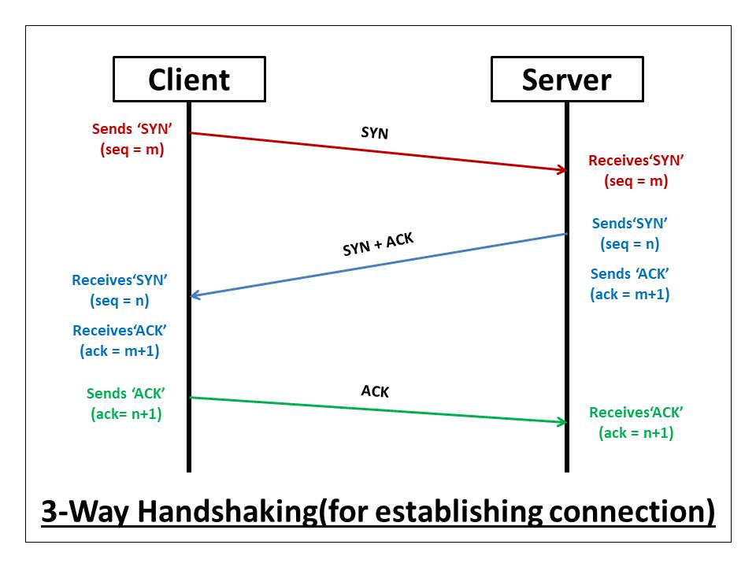

# ACK-flood DDOS attack

## Introduction

## Three-way TCP handshake

Let's take an example of a simple **three-way TCP handshake**. This handshake allows to estasblish a connection between the client (you) and the host (i.e: youtube)

In the figure above you can actually see what happens when you ask for online content. The first thing is to connect to the distant server with a TCP handshake. Let's break it down.

The Client first sends a **SYN** request to the Server.

Then the Server reply with a SYN + ACK.

Finally the Client end the handhshake with an ACK request and the connection is established.

From this simple protocol we already can perform an attack. 

